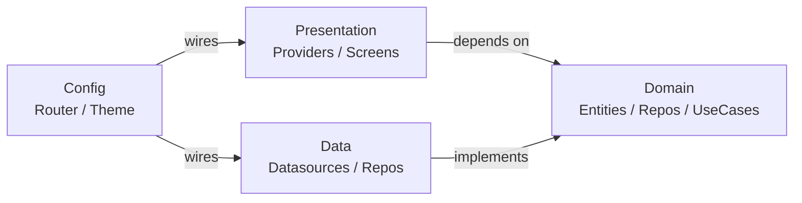

Virtual Catalog is structured around Clean Architecture principles: business rules live in a pure Dart domain layer that has zero dependencies on Flutter, Firebase, or any external package. The data and presentation layers depend inward on the domain, never the other way around. This boundary makes it straightforward to swap Firebase for another backend, or replace Provider with a different state management solution, without touching a single line of business logic.

## The four layers

<CardGroup cols={2}>
  <Card title="Domain" icon="cube">
    Entities, repository interfaces, and use cases. Pure Dart — no Flutter or Firebase imports.
  </Card>
  <Card title="Data" icon="database">
    Datasource implementations (Firestore, Firebase Auth, SharedPreferences, Dio) and repository adapters that satisfy domain interfaces.
  </Card>
  <Card title="Presentation" icon="display">
    Provider-based state management, screens, and widgets. Reads from and writes to domain repositories through providers.
  </Card>
  <Card title="Config" icon="gear">
    Go Router setup, Material theme configuration, Firebase initialization, and environment variable loading.
  </Card>
</CardGroup>

## Directory structure

| Directory | Layer | Contents |
|-----------|-------|----------|
| `lib/domain/entities/` | Domain | `Business`, `Product`, `ProductVariant`, `CartItem`, `Order`, `BannerItem`, `HomeBlock`, `DeliveryMethod`, `PaymentMethod` |
| `lib/domain/repos/` | Domain | Abstract repository interfaces: `ProductRepository`, `BusinessRepository`, `AuthRepository`, `OrderRepository` |
| `lib/domain/datasources/` | Domain | Abstract datasource interfaces consumed by data implementations |
| `lib/domain/usecases/` | Domain | Single-responsibility use cases (e.g. `CreateIzipayPaymentUseCase`) |
| `lib/data/datasources/` | Data | Concrete implementations: `ProductDatasourceImpl` (Firestore), `BusinessDatasourceImpl` (Firestore), `AuthDatasourceImpl` (Firebase Auth), `CartDatasourceImpl` (SharedPreferences), `IzipayDatasourceImpl` (Dio/HTTP) |
| `lib/data/repos/` | Data | Repository adapters: `ProductRepositoryImpl`, `BusinessRepositoryImpl`, `AuthRepositoryImpl`, `CartRepositoryImpl`, `OrderRepositoryImpl`, `IzipayRepositoryImpl` |
| `lib/data/models/` | Data | Firestore-aware model classes with `fromFirestore` / `toJson` conversion |
| `lib/presentation/providers/` | Presentation | `ProductProvider`, `BusinessProvider`, `AuthProvider`, `CartProvider`, `OrderProvider`, `IzipayProvider` |
| `lib/presentation/screens/` | Presentation | Full-page screen widgets (Home, Catalog, ProductDetail, Checkout, Admin\*) |
| `lib/presentation/widgets/` | Presentation | Reusable widget components and admin sub-views |
| `lib/config/routers/` | Config | `app_router.dart` — Go Router definition with all routes and redirect logic |
| `lib/config/themes/` | Config | `ThemeConfig` — Material theme builder driven by `Business.themeColorHex` |
| `lib/config/firebase/` | Config | `firebase_options.dart` — per-platform Firebase initialization |

## Dependency rule

The golden rule is that source code dependencies only point inward — toward the domain.



The domain layer imports nothing outside of the Dart standard library. The data layer imports Firebase, Dio, and SharedPreferences, but only ever exposes domain entities to the rest of the app — never raw Firestore documents. The presentation layer only ever calls domain repository interfaces; it has no knowledge of Firestore, Dio, or SharedPreferences.

## How Provider wires everything together

`main.dart` is the composition root. It is the only place in the codebase where concrete implementations are instantiated and injected. Every provider receives a repository interface, and every repository implementation receives a datasource implementation.

```dart main.dart
void main() async {
  WidgetsFlutterBinding.ensureInitialized();
  await dotenv.load(fileName: "env");
  await Firebase.initializeApp(options: DefaultFirebaseOptions.currentPlatform);

  runApp(const MainApp());
}

class MainApp extends StatelessWidget {
  @override
  Widget build(BuildContext context) {
    return MultiProvider(
      providers: [
        ChangeNotifierProvider(
          create: (_) => ProductProvider(
            repository: ProductRepositoryImpl(
              datasource: ProductDatasourceImpl(),    // Firestore
            ),
          ),
        ),
        ChangeNotifierProvider(
          create: (_) => CartProvider(
            repository: CartRepositoryImpl(
              datasource: CartDatasourceImpl(),       // SharedPreferences
            ),
          ),
        ),
        ChangeNotifierProvider(
          create: (_) => BusinessProvider(
            repository: BusinessRepositoryImpl(
              datasource: BusinessDatasourceImpl(),   // Firestore
            ),
          ),
        ),
        ChangeNotifierProvider(
          create: (_) => AuthProvider(
            authRepository: AuthRepositoryImpl(
              datasource: AuthDatasourceImpl(),       // Firebase Auth
            ),
          ),
        ),
        ChangeNotifierProvider(
          create: (_) => IzipayProvider(
            createIzipayPaymentUseCase: CreateIzipayPaymentUseCase(
              IzipayRepositoryImpl(
                izipayDataSource: IzipayDatasourceImpl(dio: Dio()), // HTTP
              ),
            ),
          ),
        ),
        ChangeNotifierProvider(
          create: (_) => OrderProvider(
            repository: OrderRepositoryImpl(),       // Firestore
          ),
        ),
      ],
      child: Consumer<BusinessProvider>(
        builder: (context, businessProvider, child) {
          // Theme rebuilds reactively when business changes
          final customColor = ThemeConfig.hexToColor(
            businessProvider.business?.themeColorHex,
          );
          return MaterialApp.router(
            theme: ThemeConfig(selectedColor: 0, customColor: customColor).getTheme(),
            routerConfig: appRouter,
          );
        },
      ),
    );
  }
}
```

<Note>
`BusinessProvider` sits at the outermost `Consumer` so the `MaterialApp` theme reacts immediately when a business is loaded — no separate rebuild pass required.
</Note>

## Data flow for a typical screen

<Steps>
  <Step title="Route resolves">
    Go Router matches the URL (e.g. `/:businessSlug`), extracts path parameters, and renders the target screen inside the appropriate `ShellRoute`.
  </Step>
  <Step title="ShellRoute triggers data loading">
    The shell's `builder` calls `ProductProvider.loadProducts(slug)` and `BusinessProvider.loadBusiness(slug)` via `addPostFrameCallback`, ensuring the frame renders before the async work begins.
  </Step>
  <Step title="Provider calls the repository">
    The provider calls the domain repository interface (e.g. `ProductRepository.getProducts`). The repository implementation delegates to its datasource, which queries Firestore and maps the result to domain entities.
  </Step>
  <Step title="Notifier updates the UI">
    The provider calls `notifyListeners()`. Every widget that reads from that provider via `context.watch` or `Consumer` rebuilds with the new data.
  </Step>
</Steps>
