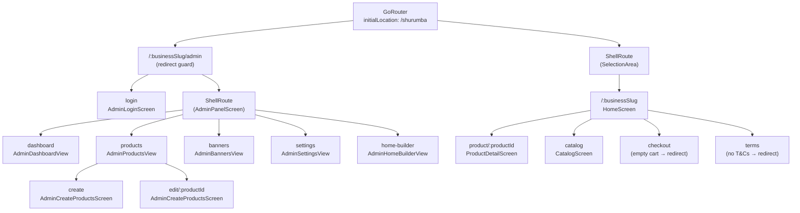

Virtual Catalog uses [Go Router](https://pub.dev/packages/go_router) for declarative, URL-driven navigation. Every storefront lives under a `/:businessSlug` prefix, which means a single deployed app serves multiple independent storefronts. Customer-facing and admin routes are defined in a single `GoRouter` instance in `lib/config/routers/app_router.dart`, and route guards enforce authentication state through the router's `redirect` callbacks — no manual navigation logic in screens.

## Route table

| Route | Type | Auth required | Description |
|-------|------|---------------|-------------|
| `/:businessSlug` | Customer | No | Storefront home page with hero banners and `HomeBlock` product sections |
| `/:businessSlug/product/:productId` | Customer | No | Product detail page |
| `/:businessSlug/catalog` | Customer | No | Full catalog with search and filter query params |
| `/:businessSlug/checkout` | Customer | No | Checkout form; redirects to `/:businessSlug` when cart is empty |
| `/:businessSlug/terms` | Customer | No | Terms and conditions page; redirects to `/:businessSlug` when `termsAndConditions` is null or blank |
| `/:businessSlug/admin/login` | Admin | No | Admin login form |
| `/:businessSlug/admin/dashboard` | Admin | Yes | Order management dashboard |
| `/:businessSlug/admin/products` | Admin | Yes | Product list |
| `/:businessSlug/admin/products/create` | Admin | Yes | Create a new product |
| `/:businessSlug/admin/products/edit/:productId` | Admin | Yes | Edit an existing product |
| `/:businessSlug/admin/banners` | Admin | Yes | Banner carousel management |
| `/:businessSlug/admin/settings` | Admin | Yes | Business settings (logo, WhatsApp, theme, etc.) |
| `/:businessSlug/admin/home-builder` | Admin | Yes | Home page block layout editor |

### Catalog query parameters

The `/:businessSlug/catalog` route reads the following URL query parameters on load. All parameters are optional.

| Parameter | Type | Description |
|-----------|------|-------------|
| `search` | `String` | Free-text keyword search |
| `category` | `String` | Filter by product category |
| `sort` | `String` | Sort order identifier |
| `minPrice` | `double` | Minimum price filter |
| `maxPrice` | `double` | Maximum price filter |
| `sizes` | `String` (comma-separated) | Filter by one or more size labels |
| `available` | `"true"` | When present, show only available products |

## Router initialization

```dart lib/config/routers/app_router.dart
final appRouter = GoRouter(
  initialLocation: "/shurumba",
  errorBuilder: (context, state) {
    return Scaffold(
      body: Center(child: Text("404 - Página no encontrada")),
    );
  },
  routes: [
    // Admin subtree
    GoRoute(
      path: "/:businessSlug/admin",
      redirect: (context, state) { ... },
      routes: [
        GoRoute(path: "login", ...),
        ShellRoute(
          builder: (context, state, child) { ... }, // loads ProductProvider + BusinessProvider
          routes: [
            GoRoute(path: "dashboard", ...),
            GoRoute(path: "products", routes: [
              GoRoute(path: "create", ...),
              GoRoute(path: "edit/:productId", ...),
            ]),
            GoRoute(path: "banners", ...),
            GoRoute(path: "settings", ...),
            GoRoute(path: "home-builder", ...),
          ],
        ),
      ],
    ),
    // Customer subtree
    ShellRoute(
      builder: (context, state, child) { ... }, // loads ProductProvider + BusinessProvider + CartProvider
      routes: [
        GoRoute(
          path: "/:businessSlug",
          routes: [
            GoRoute(path: "product/:productId", ...),
            GoRoute(path: "catalog", ...),
            GoRoute(path: "checkout", redirect: ..., ...),
            GoRoute(path: "terms", redirect: ..., ...),
          ],
        ),
      ],
    ),
  ],
);
```

## Authentication redirect logic

The `/:businessSlug/admin` parent route evaluates `AuthProvider.isAuthenticated` on every navigation event within the admin subtree.

```dart lib/config/routers/app_router.dart
redirect: (context, state) {
  final isAuth = context.read<AuthProvider>().isAuthenticated;
  final slug = state.pathParameters["businessSlug"]!;
  final location = state.uri.path;
  final isGoingToLogin = location.endsWith("/login");
  final isGoingToAdmin =
      location == "/$slug/admin" || location == "/$slug/admin/";

  if (!isAuth) {
    // Unauthenticated users are sent to login for any admin URL
    if (!isGoingToLogin) return "/$slug/admin/login";
  } else {
    // Authenticated users are redirected away from login and the bare /admin path
    if (isGoingToLogin || isGoingToAdmin) return "/$slug/admin/dashboard";
  }
  return null; // no redirect needed
},
```

The redirect table in plain terms:

| User state | Destination | Result |
|------------|-------------|--------|
| Unauthenticated | Any admin URL except `/login` | Redirect to `/:slug/admin/login` |
| Unauthenticated | `/login` | Allowed through |
| Authenticated | `/login` | Redirect to `/:slug/admin/dashboard` |
| Authenticated | `/:slug/admin` or `/:slug/admin/` | Redirect to `/:slug/admin/dashboard` |
| Authenticated | Any other admin URL | Allowed through |

<Note>
`AuthProvider` subscribes to `FirebaseAuth.authStateChanges` in its constructor. This means the redirect is evaluated with live auth state — if a user's session expires mid-session, the next navigation within the admin subtree will immediately redirect them to `/login`.
</Note>

## Content-driven redirects

Two customer routes redirect based on business data rather than authentication state.

**Checkout** — redirects to `/:businessSlug` when the cart is empty:

```dart lib/config/routers/app_router.dart
GoRoute(
  path: "checkout",
  redirect: (context, state) {
    final cartProvider = context.read<CartProvider>();
    if (cartProvider.checkItems.isEmpty) {
      final slug = state.pathParameters["businessSlug"];
      return "/$slug";
    }
    return null;
  },
  ...
),
```

**Terms** — redirects to `/:businessSlug` when `Business.termsAndConditions` is null or blank:

```dart lib/config/routers/app_router.dart
GoRoute(
  path: "terms",
  redirect: (context, state) {
    final business = context.read<BusinessProvider>().business;
    if (business == null ||
        business.termsAndConditions == null ||
        business.termsAndConditions!.trim().isEmpty) {
      final slug = state.pathParameters["businessSlug"];
      return "/$slug";
    }
    return null;
  },
  ...
),
```

## ShellRoute usage

Virtual Catalog uses `ShellRoute` in two places to run shared initialization logic once, regardless of which child route is active.

<Tabs>
  <Tab title="Customer shell">

    Wraps all customer routes under `/:businessSlug`. On each slug change it loads products, business data, and the persisted cart from `SharedPreferences`. The child is rendered inside a `SelectionArea` to enable text selection on web.

    ```dart lib/config/routers/app_router.dart
    ShellRoute(
      builder: (context, state, child) {
        final slug = state.pathParameters["businessSlug"];
        if (slug != null) {
          WidgetsBinding.instance.addPostFrameCallback((_) {
            context.read<ProductProvider>().loadProducts(slug);
            context.read<BusinessProvider>().loadBusiness(slug);
            context.read<CartProvider>().setBusinessSlug(slug);
          });
        }
        return SelectionArea(child: child);
      },
      routes: [ ... ],
    )
    ```

  </Tab>
  <Tab title="Admin shell">

    Wraps all authenticated admin routes. Renders the `AdminPanelScreen` persistent layout (sidebar navigation, header) and passes `child` as the content area. Also triggers product and business data loading so the admin panel has data before any sub-view is displayed.

    ```dart lib/config/routers/app_router.dart
    ShellRoute(
      builder: (context, state, child) {
        final slug = state.pathParameters["businessSlug"]!;
        WidgetsBinding.instance.addPostFrameCallback((_) {
          context.read<ProductProvider>().loadProducts(slug);
          context.read<BusinessProvider>().loadBusiness(slug);
        });
        return AdminPanelScreen(businessSlug: slug, child: child);
      },
      routes: [ ... ],
    )
    ```

  </Tab>
</Tabs>

<Tip>
Both shells use `addPostFrameCallback` so the data fetch starts after the current frame is committed. This prevents `setState`-during-build errors and ensures the shell widget tree is fully mounted before providers are updated.
</Tip>

## Route hierarchy diagram


